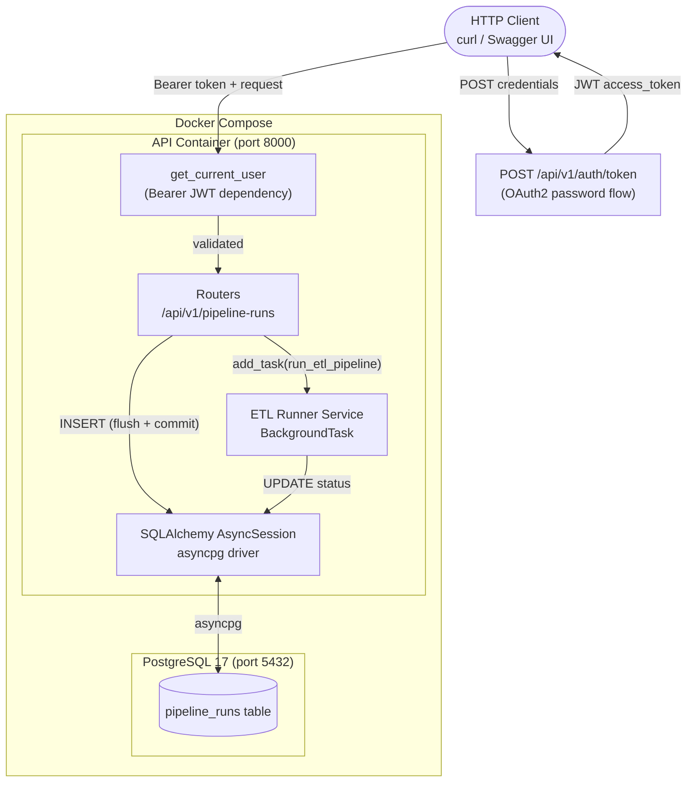

# etl-microservice-fastapi

A **production-ready FastAPI microservice** that exposes a REST API for triggering, monitoring, and managing ETL pipeline runs, protected by JWT Bearer authentication.

Built to showcase Senior Data Platform Engineering practices: async-first design, strong typing, clean layered architecture, and a single-command local environment.

---

## Architecture



**Request lifecycle:**

1. Client calls `POST /api/v1/auth/token` with credentials → receives a signed JWT.
2. `POST /api/v1/pipeline-runs` — Bearer token is validated, a `PipelineRun` row is inserted (status `PENDING`), committed, and `run_etl_pipeline` is enqueued as a FastAPI `BackgroundTask`. Returns `202 Accepted` immediately.
3. `run_etl_pipeline` opens its own async session, transitions the run `RUNNING → SUCCESS | FAILED` (10 % simulated failure rate), writing timestamps at each step.
4. Any subsequent `GET` reflects the live status.

---

## Tech Stack

| Layer | Technology |
|---|---|
| Runtime | Python 3.14 |
| API Framework | FastAPI 0.115+ |
| Validation | Pydantic v2 |
| Authentication | JWT Bearer — PyJWT + OAuth2 password flow |
| ORM | SQLAlchemy 2.x (async) |
| DB Driver | asyncpg |
| Database | PostgreSQL 17 |
| Migrations | Alembic |
| Testing | pytest + pytest-asyncio + httpx |
| Packaging | pyproject.toml (hatchling) |
| Infra | Docker Compose |

---

## Prerequisites

- [Docker Desktop](https://www.docker.com/products/docker-desktop/) (or Docker Engine + Compose plugin)
- Python 3.14 and pip *(only needed for running tests locally outside Docker)*

---

## Quickstart

```bash
# 1. Clone
git clone https://github.com/<you>/etl-microservice-fastapi.git
cd etl-microservice-fastapi

# 2. Copy environment config and set a real secret key
cp .env.example .env
# Edit .env and replace JWT_SECRET_KEY with: openssl rand -hex 32

# 3. Start everything (Postgres + API + auto-migration)
docker compose up --build

# API is now live at  http://localhost:8000
# Interactive docs:   http://localhost:8000/docs
```

The `api` container runs `alembic upgrade head` before starting uvicorn, so the schema is always in sync.

---

## Authentication

All `/api/v1/pipeline-runs` endpoints require a **Bearer JWT**. The `/health` endpoint is public.

### Get a token

```bash
curl -s -X POST http://localhost:8000/api/v1/auth/token \
  -d "username=admin&password=changeme"
```

```json
{
  "access_token": "eyJhbGciOiJIUzI1NiIsInR5cCI6IkpXVCJ9...",
  "token_type": "bearer"
}
```

Store the token and pass it as a header on every subsequent request:

```bash
export TOKEN="eyJhbGciOiJIUzI1NiIsInR5cCI6IkpXVCJ9..."
curl http://localhost:8000/api/v1/pipeline-runs \
  -H "Authorization: Bearer $TOKEN"
```

Tokens expire after 60 minutes (configurable via `JWT_EXPIRE_MINUTES`). Request a new one when expired.

> **Production note:** replace the default `JWT_SECRET_KEY` and `API_PASSWORD` in `.env` with strong values. The defaults are intentionally weak and for local development only.

---

## API Reference

### Auth

| Method | Path | Description | Auth required |
|--------|------|-------------|:---:|
| `POST` | `/api/v1/auth/token` | Exchange credentials for a JWT | No |

### Pipeline Runs

| Method | Path | Description | Status |
|--------|------|-------------|--------|
| `POST` | `/api/v1/pipeline-runs` | Trigger a new pipeline run | `202 Accepted` |
| `GET` | `/api/v1/pipeline-runs` | List runs (`?status=`, `?limit=`, `?offset=`) | `200 OK` |
| `GET` | `/api/v1/pipeline-runs/{run_id}` | Get a single run by UUID | `200 OK` |
| `DELETE` | `/api/v1/pipeline-runs/{run_id}` | Cancel a PENDING run | `204 No Content` |

### Ops

| Method | Path | Description | Auth required |
|--------|------|-------------|:---:|
| `GET` | `/health` | Liveness probe | No |

### Pipeline Run object

```json
{
  "id": "3fa85f64-5717-4562-b3fc-2c963f66afa6",
  "pipeline_name": "daily-ingest",
  "status": "SUCCESS",
  "triggered_at": "2026-06-10T09:00:00Z",
  "started_at": "2026-06-10T09:00:01Z",
  "finished_at": "2026-06-10T09:00:04Z",
  "error_message": null,
  "metadata": {"source": "s3://data-lake/raw/2026-06-10"}
}
```

**Status values:** `PENDING` → `RUNNING` → `SUCCESS` | `FAILED` | `CANCELLED`

### Error responses

All errors return a consistent JSON body:

```json
{
  "detail": {
    "error": "PipelineRunNotFound",
    "message": "Pipeline run '3fa85f64-...' not found."
  }
}
```

| HTTP | Error key | When |
|------|-----------|------|
| `401` | `Unauthorized` | Missing, invalid, or expired JWT |
| `404` | `PipelineRunNotFound` | Run ID does not exist |
| `409` | `InvalidStatusTransition` | e.g. cancelling a non-PENDING run |
| `422` | — | Request body / path param validation failure |

---

## Example curl Commands

```bash
# 0. Get a token (store it for reuse)
TOKEN=$(curl -s -X POST http://localhost:8000/api/v1/auth/token \
  -d "username=admin&password=changeme" | python3 -c "import sys,json; print(json.load(sys.stdin)['access_token'])")

# 1. Trigger a pipeline run
curl -s -X POST http://localhost:8000/api/v1/pipeline-runs \
  -H "Authorization: Bearer $TOKEN" \
  -H "Content-Type: application/json" \
  -d '{"pipeline_name": "daily-ingest", "metadata": {"source": "s3://bucket/2026-06-10"}}' \
  | python3 -m json.tool

# 2. List all runs
curl -s http://localhost:8000/api/v1/pipeline-runs \
  -H "Authorization: Bearer $TOKEN" | python3 -m json.tool

# 3. Filter by status + paginate
curl -s "http://localhost:8000/api/v1/pipeline-runs?status=PENDING&limit=5" \
  -H "Authorization: Bearer $TOKEN" | python3 -m json.tool

# 4. Poll a specific run until it finishes
RUN_ID="3fa85f64-5717-4562-b3fc-2c963f66afa6"
curl -s http://localhost:8000/api/v1/pipeline-runs/$RUN_ID \
  -H "Authorization: Bearer $TOKEN" | python3 -m json.tool

# 5. Cancel a pending run
curl -s -X DELETE http://localhost:8000/api/v1/pipeline-runs/$RUN_ID \
  -H "Authorization: Bearer $TOKEN" \
  -w "\nHTTP %{http_code}\n"

# 6. Health check (no auth)
curl -s http://localhost:8000/health
```

---

## Running Migrations Manually

```bash
# Apply all pending migrations
docker compose exec api alembic upgrade head

# Generate a new migration after changing models
docker compose exec api alembic revision --autogenerate -m "add column X"

# Downgrade one step
docker compose exec api alembic downgrade -1

# View migration history
docker compose exec api alembic history --verbose
```

---

## Running Tests

Tests use an isolated **SQLite** database (via `aiosqlite`) — no running Postgres required.

```bash
# Set up the virtual environment
python3.14 -m venv .venv
source .venv/bin/activate        # Linux/macOS
.venv\Scripts\Activate.ps1       # Windows PowerShell
pip install -e ".[dev]"

# Run all tests
pytest

# With coverage report
pytest --cov=app --cov-report=term-missing

# Run a specific file
pytest tests/test_auth.py -v
pytest tests/test_etl_runner.py -v
```

---

## Project Structure

```
etl-microservice-fastapi/
├── docker-compose.yml          # Two-service stack: api + postgres
├── Dockerfile                  # Python 3.14 slim, editable install
├── pyproject.toml              # Dependencies, build config, pytest settings
├── .env.example                # All required environment variables
├── alembic.ini                 # Alembic entry point
├── alembic/
│   ├── env.py                  # Async-aware migration runner
│   └── versions/
│       └── f3e2d1c0b9a8_initial_pipeline_runs.py
├── app/
│   ├── main.py                 # FastAPI app factory + lifespan
│   ├── config.py               # Settings (pydantic-settings, lru_cache)
│   ├── database.py             # Async engine, session factory, get_db dep
│   ├── exceptions.py           # Typed HTTP exceptions
│   ├── auth/
│   │   ├── jwt_utils.py        # Token creation + validation (PyJWT)
│   │   ├── dependencies.py     # get_current_user FastAPI dependency
│   │   ├── router.py           # POST /auth/token
│   │   └── schemas.py          # Token response schema
│   ├── models/
│   │   └── pipeline_run.py     # PipelineRun ORM + PipelineStatus enum
│   ├── schemas/
│   │   └── pipeline_run.py     # Pydantic v2 request / response schemas
│   ├── routers/
│   │   └── pipeline_runs.py    # CRUD + trigger endpoints (JWT-protected)
│   └── services/
│       └── etl_runner.py       # Background ETL simulation
└── tests/
    ├── conftest.py             # SQLite test DB, mocked ETL runner, authed_client
    ├── test_auth.py            # Auth flow + JWT unit tests
    ├── test_pipeline_runs.py   # Full endpoint coverage (auth + business logic)
    └── test_etl_runner.py      # Service-layer unit tests
```

---

## Design Decisions

**JWT with `auto_error=False`** — FastAPI's `HTTPBearer` returns `403` by default when no header is present. Setting `auto_error=False` and handling the `None` case ourselves gives a consistent `401` for both missing and invalid tokens, which is what RFC 6750 recommends.

**Router-level auth dependency** — `dependencies=[Depends(get_current_user)]` on the `APIRouter` protects every endpoint in the router without touching each function signature. The username is available if needed by adding it as a typed parameter.

**UUID primary keys** — collision-proof across distributed systems; safe to expose externally without leaking row counts.

**`run_metadata` → `metadata` column** — SQLAlchemy's `DeclarativeBase` reserves the `metadata` attribute for its internal `MetaData` object. The ORM attribute is `run_metadata`; the DB column and API field are both `metadata` (via `mapped_column("metadata", ...)` and Pydantic's `validation_alias`).

**Explicit commit before background task** — `run_etl_pipeline` opens its own session. Committing before `add_task` guarantees the row is visible when the background task reads it, regardless of ASGI lifecycle ordering.

**SQLite for tests** — keeps tests dependency-free (no Postgres container needed in CI). Cross-DB-compatible SQLAlchemy types (`sa.Uuid`, `sa.JSON`, `sa.Enum(..., native_enum=False)`) are used throughout.

**`authed_client` fixture** — separates the concern of authentication from business-logic tests. All pipeline endpoint tests use the pre-authenticated client; 401 tests use the plain unauthenticated one.


---

## License

MIT